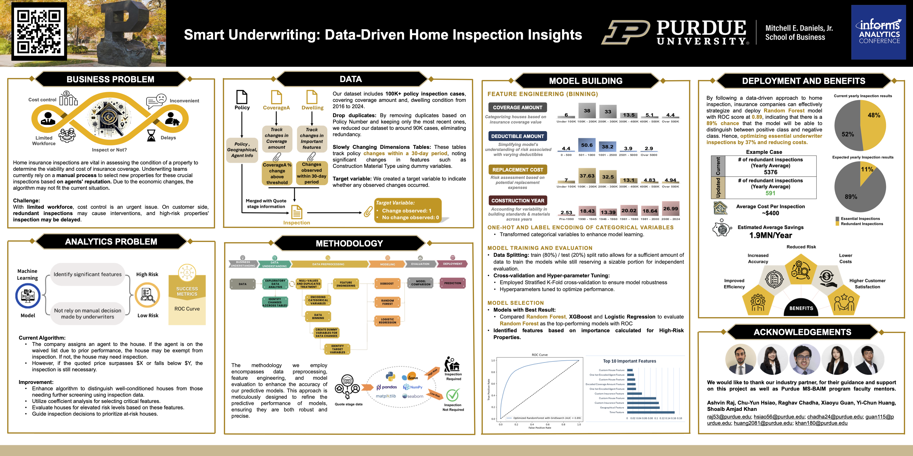

# Hi there 👋 This is Xiaoyu
I'm Xiaoyu Guan, loving cats🐱 and coffee☕️ and on the way to exploring how data reveal the world 😎
### Something about me ...
- 🏃 MS student at Purdue University, Business Analytics and Information Management program ' 24
- 📫 E-mail me at: guanxiaoyu991113@gmail.com 
- ☎️ Call me at: (+1) 765-694-9684
- 🏠 Based in West Lafayette, Indiana 
  
## ⚡️ Skills
- Programming/database platform: SQL, Python (NumPy, pandas, sklearn, matplotlib), R, SAS Enterprise Miner
- Analytics/visualization tool: Tableau, Advanced Excel (pivot table, solver, VLOOKUP, @RISK), Minitab
- Management tool: Smartsheet, MS Project
- Certification: Azure Fundamentals, AWS certified Cloud Practitioner, AWS Academy Machine Learning Foundations

## 🎓 Education Experience
### Purdue University
*Master* - *Business Analytics and Information Management (BAIM)*
- 2023 August - 2024 August
- West Lafayette, Indiana
- **Relevant Course**: Business Analytics (Linear Regression, Hypothesis test), Adavanced Business Analytics (R, Time Series Analysis), Visual Analytics (Tableau), Big Data (GCP), Cloud Computing (AWS), Data Scientist in the Cloud (AWS-Sagemaker, Optimization), Management of Organizational Data (SQL), Data Mining, Spreadsheet Modeling and Simulation (Solver, @RISK), Financial Risk Management, Fix Income Security

### Tianjin University of Commerce
*Bachelor* - *Finance*
- 2018 September - 2022 June
- Tianjin, China
- **Relevant Course**: Econometrics, Higher Mathematics, Linear Algebra, Probability Statistics, Financial Marketing, International Finance, Financial Management, Financial Analysis, Accounting

## 📖 Academic Projects
### Property risk level prediction for House Insurance company
- Conducted **cost analysis** on redundant inspections, exposing limitations in the current algorithm for identifying at-risk properties.
- Employed **data binning**, **categorical variable encoding**, and **feature engineering** to pinpoint the top ten most influential variables.
- Developed **predictive model** to forcast the risk level for a new coming property based on history inspection data. Implemented machine learning tools including **logistic regression**, **XGBoost** and **random forest** to forecast house condition, optimized current algorithms by **reducing** 80% of redundant inspection cases, predicted to **save** about $421k per year.
- [Project information](https://github.com/Xiaoyuu99/Predictive_analysis_for_house_insurance/tree/main)
- Poster:
  
  

### Auto Parts Inventory Optimization with AWS
- Implemented **Amazon S3** to saved the data, **AWS Glue** to extract sample store data, fill missing value, transform string data to category, and do EDA for processed dataset.
- Using **Amazon Sagermaker** to build the predictive model for selling condition and selling quantity for each product, utilized stratified k-folds cross validation to evaluate the accuracy of the model.
- Using **AWS Labmda** to build the optimization model, implemented **pyomo** to get the optimal inventory level for each listed product with the space and feasible revenue constrains.
- [Project information](https://github.com/Xiaoyuu99/Auto-Parts-Inventory-Optimization)
- Poster:

  

### NCAA Championship Tickets Sales Prediction
- Pre-processed large amount of data (> 200k) with Python, identified potential patterns behind duration of time and history activity, created new table to track the patterns. Encoded categorical data to prepare for model training.
- Applied machine learning tools including logistic regression, decision tree algorithm, neural network and XGBoost to predict the tickets sales, optimizing towards an accuracy score metrics. Achieved in a model performance of 0.979 in accuracy on the test dataset with XGBoost model.
- [Project information](https://github.com/Xiaoyuu99/CACC)
  
### 

<!--
**Xiaoyuu99/Xiaoyuu99** is a ✨ _special_ ✨ repository because its `README.md` (this file) appears on your GitHub profile.

Here are some ideas to get you started:

- 🔭 I’m currently working on ...
- 🌱 I’m currently learning ...
- 👯 I’m looking to collaborate on ...
- 🤔 I’m looking for help with ...
- 💬 Ask me about ...
- 📫 How to reach me: ...
- 😄 Pronouns: ...
- ⚡ Fun fact: ...
--> 
